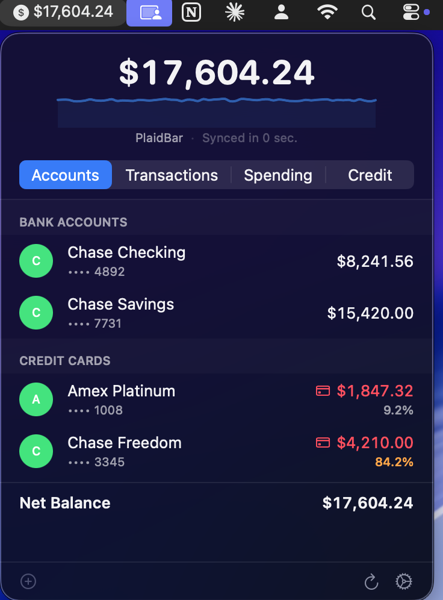
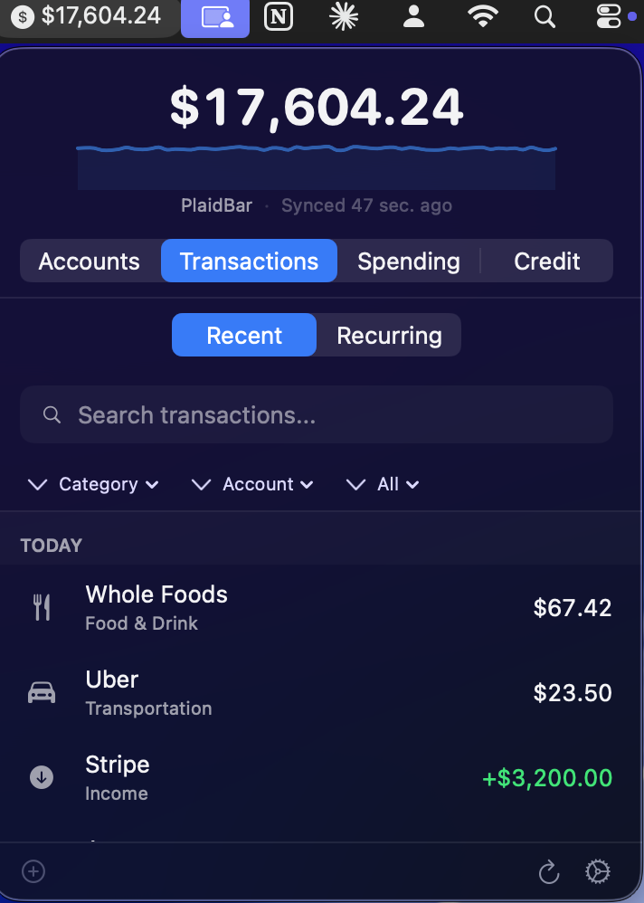
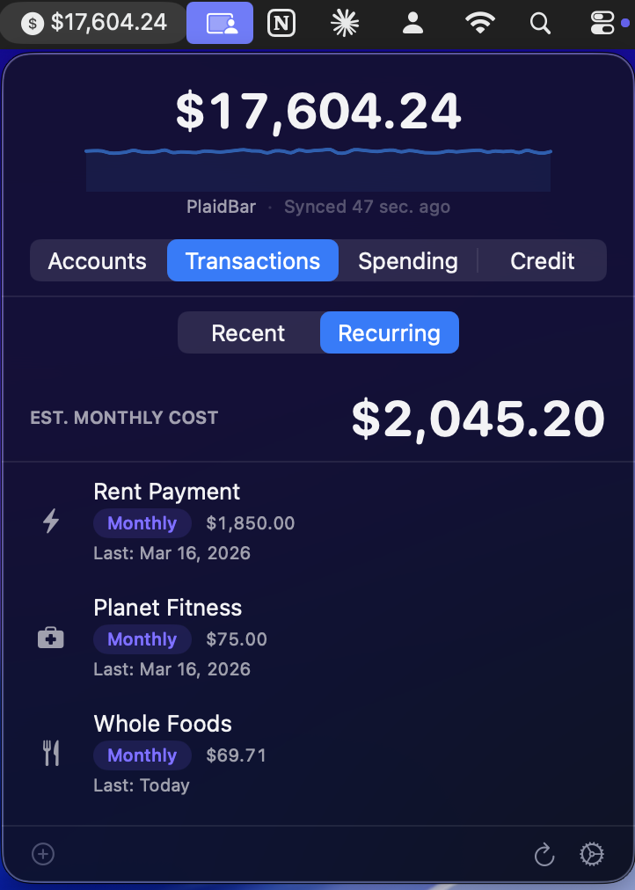
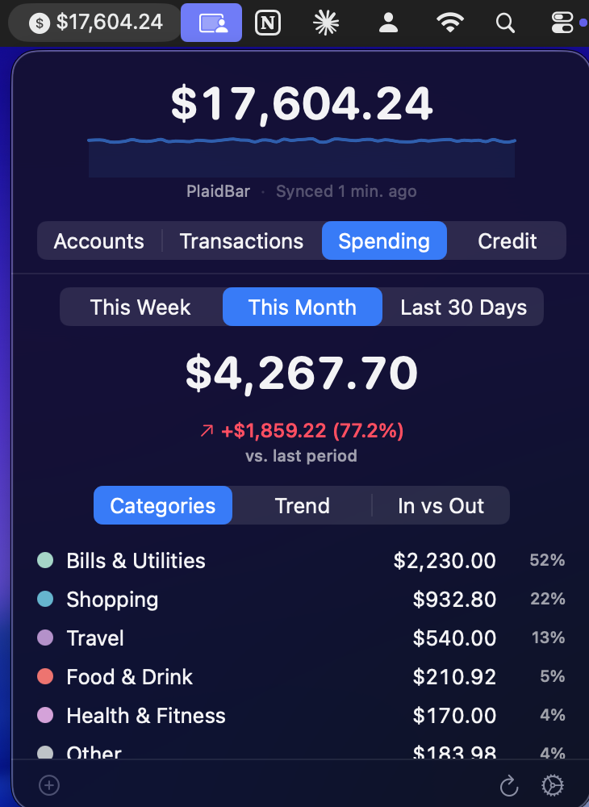
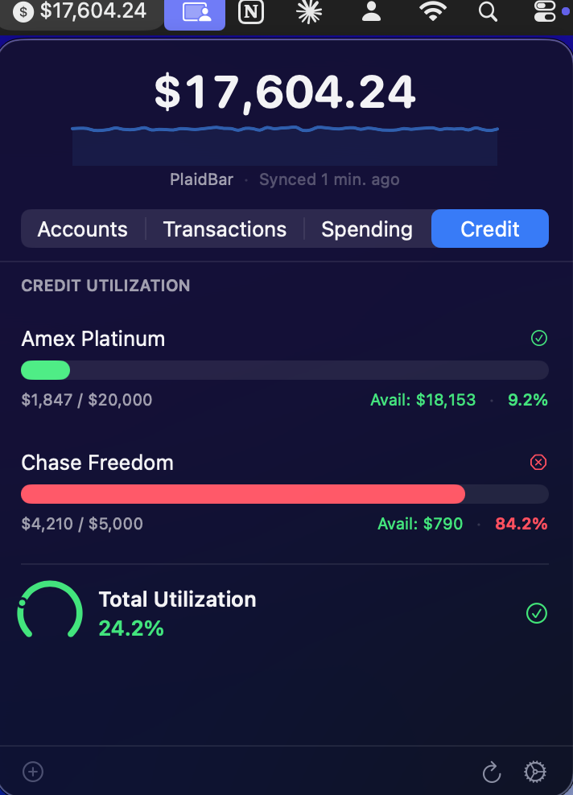

<p align="center">
  
</p>

<h1 align="center">PlaidBar</h1>

<p align="center">
  <strong>Your bank accounts, credit cards, and spending — always one click away in the macOS menu bar.</strong>
</p>

<p align="center">
  <a href="https://github.com/ftchvs/PlaidBar/actions/workflows/ci.yml"></a>
  <a href="https://github.com/ftchvs/PlaidBar/blob/main/LICENSE"></a>
  
  
</p>

---

PlaidBar is an open-source macOS menu bar dashboard for [Plaid](https://plaid.com) data. It is designed in the spirit of tools like CodexBar: keep the high-signal numbers one click away, stay native to macOS, and avoid a hosted backend.

**No cloud. No telemetry. All data stays local.**

## Why PlaidBar?

Personal finance data lives behind bank website logins. The closest thing to a menu bar finance app was [Balance](https://balancemy.money/) — commercial and now defunct. PlaidBar fills that gap as an open-source, privacy-first alternative.

- **Glanceable** — Net balance visible right in the menu bar
- **Account Balances** — All bank accounts and credit cards at a glance
- **Recent Transactions** — Searchable, filterable list grouped by day with category icons
- **Transaction Detail** — Tap any transaction for merchant, category, account, and status details
- **Transaction Filtering** — Filter by category, account, or date range with chip controls
- **Recurring Detection** — Automatic identification of subscriptions and recurring charges with monthly total
- **Spending Breakdown** — Donut chart, GitHub-style daily spending heatmap, trend line, income vs expense views, and month-over-month comparison
- **Credit Utilization** — Progress bars with configurable warning thresholds and gauge
- **Smart Notifications** — Alerts for large transactions, low balances, and high credit utilization
- **Balance History** — Sparkline showing net balance trend over time
- **Keyboard Shortcuts** — Cmd+1-4 to switch tabs, Cmd+R to refresh, Cmd+N to add account
- **Settings Persistence** — Preferences saved across launches
- **Launch at Login** — Optional auto-start via macOS Login Items
- **Auto-Updates** — Sparkle integration for seamless updates
- **Sandbox Mode** — Test the real Plaid sandbox flow before using production credentials
- **Demo Mode** — Render screenshot/demo data without hitting Plaid
- **Private** — Everything stored locally on your Mac, period

## Screenshots

<p align="center">
  
  
  
</p>
<p align="center">
  
  
</p>

> Generate screenshots: `./Scripts/screenshots.sh` (requires building in release mode)

## Quick Start

### 1. Clone and build

```bash
git clone https://github.com/ftchvs/PlaidBar.git
cd PlaidBar
swift build
```

### 2. Run in sandbox mode

```bash
export PLAID_CLIENT_ID=your_sandbox_client_id
export PLAID_SECRET=your_sandbox_secret
./Scripts/run.sh --sandbox
```

This starts both the local server and the menu bar app with Plaid's sandbox environment. Sandbox uses demo bank institutions and demo balances/transactions from Plaid, but it still requires Plaid sandbox credentials.

If you only need static UI screenshots without Plaid credentials, run the app in demo mode:

```bash
swift run PlaidBar --demo
```

### 3. Click the PlaidBar icon in your menu bar

Select **"Try with sandbox"** -> **Add Account** -> complete the Plaid sandbox login in your browser -> data appears after the account sync.

### 4. Use with real bank data (optional)

```bash
export PLAID_CLIENT_ID=your_client_id
export PLAID_SECRET=your_secret
./Scripts/run.sh
```

Get credentials free at [dashboard.plaid.com](https://dashboard.plaid.com). Sandbox works immediately; production requires Plaid approval.

## Data Modes

| Mode | Command | Plaid network calls | Data source | Intended use |
|------|---------|---------------------|-------------|--------------|
| Demo | `swift run PlaidBar --demo` | No | Hardcoded local fixtures | Screenshots and UI review |
| Sandbox | `./Scripts/run.sh --sandbox` | Yes, sandbox API | Plaid sandbox credentials | Public demo and development |
| Production | `./Scripts/run.sh` | Yes, production API | Your Plaid-approved credentials | Personal use after Plaid approval |

## Keyboard Shortcuts

| Shortcut | Action |
|----------|--------|
| `Cmd+1` | Accounts tab |
| `Cmd+2` | Transactions tab |
| `Cmd+3` | Spending tab |
| `Cmd+4` | Credit tab |
| `Cmd+R` | Refresh balances |
| `Cmd+N` | Add account |

## Accessibility

Accessibility expectations for keyboard navigation, VoiceOver labels, charts,
status indicators, and screenshots are in [ACCESSIBILITY.md](ACCESSIBILITY.md).

## Requirements

| Requirement | Version |
|------------|---------|
| macOS | 15.0 (Sequoia)+ |
| Swift | 6.0+ |
| Xcode | 16+ (or Swift toolchain) |
| Plaid account | Free for sandbox |

## Architecture

PlaidBar uses a **two-process architecture** — a SwiftUI menu bar app talks to a local companion server that proxies all Plaid API calls.

```
┌─────────────────────────────────────┐
│  PlaidBar.app (SwiftUI)             │
│  MenuBarExtra · Swift Charts        │
│  Accounts · Transactions · Spending │
└──────────────┬──────────────────────┘
               │ HTTP (localhost:8484)
┌──────────────▼──────────────────────┐
│  PlaidBarServer (Hummingbird 2)     │
│  Plaid API proxy · Fluent/SQLite    │
│  Token storage · OAuth callback     │
└──────────────┬──────────────────────┘
               │ HTTPS
┌──────────────▼──────────────────────┐
│  Plaid API                          │
│  /accounts · /transactions/sync     │
└─────────────────────────────────────┘
```

**Why a companion server?** Plaid requires that `client_secret` and `access_token` never exist in the menu bar client. The server:
1. Keeps Plaid credentials and access tokens out of the SwiftUI app process
2. Stores item tokens in a local SQLite database under `~/.plaidbar/`
3. Binds to `127.0.0.1` only — no LAN or cloud exposure
4. Can be restarted independently of the UI
5. Opens the door for future CLI tools or iOS companion

### Technology Stack

| Layer | Technology | Why |
|-------|-----------|-----|
| Menu bar app | SwiftUI `MenuBarExtra` (.window) | Native macOS, modern API |
| Charts | Swift Charts | Built-in, no dependencies |
| Design system | Semantic tokens + 8pt grid | Consistent, maintainable |
| Local server | [Hummingbird 2](https://github.com/hummingbird-project/hummingbird) | Lightweight, SwiftNIO-based, same language as app |
| Database | SQLite via [Fluent ORM](https://github.com/vapor/fluent-kit) | Migrations, queries, Hummingbird-native |
| Secrets (app) | macOS Keychain | OS-level secure storage |
| Auto-updates | [Sparkle 2](https://github.com/sparkle-project/Sparkle) | Standard for open-source macOS apps |
| Launch at login | SMAppService | Native macOS Login Items API |

### Project Structure

```
PlaidBar/
├── Sources/
│   ├── PlaidBar/                    # macOS menu bar app
│   │   ├── App/                     # @main entry, AppState
│   │   ├── Theme/                   # Design tokens, typography
│   │   ├── Views/                   # SwiftUI views (4 tabs)
│   │   │   ├── AccountsView.swift   # Balance list by account type
│   │   │   ├── TransactionsView.swift # Searchable grouped list
│   │   │   ├── SpendingView.swift   # Donut/heatmap/trend/bar charts
│   │   │   ├── CreditView.swift     # Utilization bars + gauge
│   │   │   ├── SetupView.swift      # Onboarding flow
│   │   │   └── Charts/             # Chart components
│   │   ├── Models/                  # Local cache models
│   │   ├── Services/                # HTTP client, refresh, launch
│   │   └── Settings/                # Preferences window
│   ├── PlaidBarServer/              # Local companion server
│   │   ├── Routes/                  # REST endpoints
│   │   ├── Plaid/                   # Plaid API client + models
│   │   ├── Storage/                 # Fluent models + migrations
│   │   └── Config/                  # Server configuration
│   └── PlaidBarCore/                # Shared library
│       ├── Models/                  # DTOs (Account, Transaction, etc.)
│       └── Utilities/               # Currency formatters, constants
├── Tests/                           # 61 tests across 3 suites
├── Scripts/                         # build.sh, run.sh, screenshots.sh
├── Assets/                          # README screenshots
├── DESIGN.md                        # Design system spec
├── PRD.md                           # Product requirements
├── .github/workflows/ci.yml        # GitHub Actions CI
├── Package.swift                    # SPM with 3 targets
└── LICENSE                          # MIT
```

## Plaid API Usage

PlaidBar uses these Plaid endpoints:

| Endpoint | Feature | Cost | Frequency |
|----------|---------|------|-----------|
| `/link/token/create` | Account setup | Free | On-demand |
| `/item/public_token/exchange` | Account setup | Free | Once per bank |
| `/accounts/get` | Cached balances | Free | Every 15 min |
| `/accounts/balance/get` | Real-time balances | Per-request | Manual refresh |
| `/transactions/sync` | Transactions | Per-item | Every 30 min |

Rate limits are well within Plaid's allowances for personal use (~2-4 requests/hour/item).

## Security

| Concern | How PlaidBar handles it |
|---------|------------------------|
| Plaid secrets | Read from environment variables at server startup, never embedded in the app binary |
| Plaid access tokens | Stored in local SQLite under `~/.plaidbar/`; protect your Mac user account and disk |
| Network exposure | Server binds to `127.0.0.1` only |
| App ↔ Server auth | Shared token generated at first run |
| Data at rest | macOS encrypted APFS volume |
| Distribution | Hardened runtime + notarized DMG (planned) |

**PlaidBar has no cloud backend, no analytics, no telemetry, and no tracking.** Your financial data never leaves your machine.

Do not share real Plaid credentials, access tokens, account IDs, screenshots with balances, or bank transaction exports in public issues or pull requests. See [SECURITY.md](SECURITY.md) for responsible disclosure and local data handling notes.

## Development

```bash
# Build all targets
swift build

# Build release
swift build -c release

# Run tests (61 tests)
swift test

# Run server standalone
swift run PlaidBarServer --sandbox

# Run both (server + app)
./Scripts/run.sh --sandbox

# Capture screenshots (demo mode)
./Scripts/screenshots.sh

# First-time setup helper
./Scripts/setup.sh
```

See [CONTRIBUTING.md](CONTRIBUTING.md) for code style, PR process, and architecture guidelines.

See [GOAL.md](GOAL.md) for the CodexBar-style product direction, design principles, and implementation priorities.

## Server API Reference

The companion server exposes these localhost endpoints:

| Method | Endpoint | Description |
|--------|----------|-------------|
| `GET` | `/health` | Health check |
| `GET` | `/api/status` | Server version, environment, item count |
| `GET` | `/api/items` | List connected bank items |
| `POST` | `/api/link/create` | Create Plaid Link token + URL |
| `GET` | `/oauth/callback` | Plaid OAuth redirect handler |
| `GET` | `/api/accounts` | List all accounts (cached) |
| `GET` | `/api/accounts/balances` | Real-time balances |
| `DELETE` | `/api/accounts/:itemId` | Remove a bank connection |
| `GET` | `/api/transactions/sync` | Incremental transaction sync |

## Roadmap

- [ ] Budget alerts per category
- [ ] Multi-currency support
- [ ] Investment account tracking (Plaid Investments)
- [ ] CSV/JSON export for tax/accounting
- [ ] Webhook support for real-time updates
- [x] macOS notifications for large transactions
- [ ] Homebrew cask distribution
- [ ] Dark/light theme customization
- [ ] [Teller](https://teller.io/) as alternative provider (free tier)
- [x] Recurring transaction detection

## Inspiration

- [RepoBar](https://github.com/nicklama/RepoBar) — GitHub stats in the macOS menu bar
- [Balance](https://balancemy.money/) — Commercial macOS finance app (defunct)
- [Cashculator](https://cashculator.app/) — Personal finance for Mac

## License

[MIT](LICENSE) — [Felipe Tavares Chaves](https://github.com/ftchvs)
