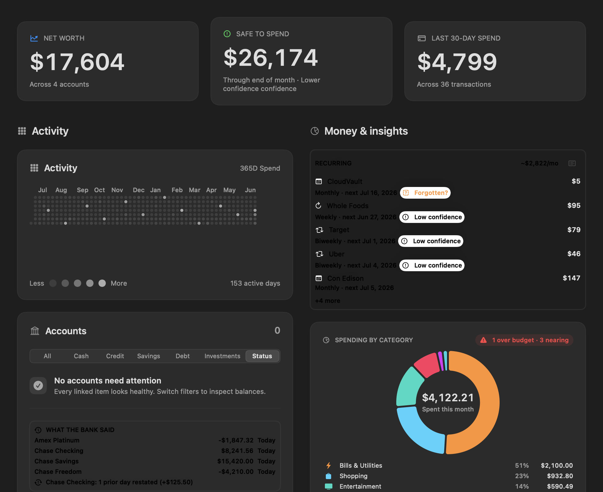
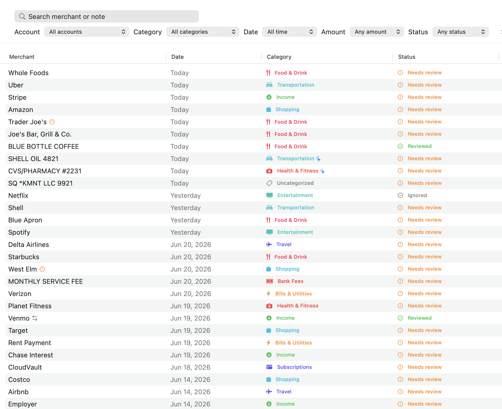
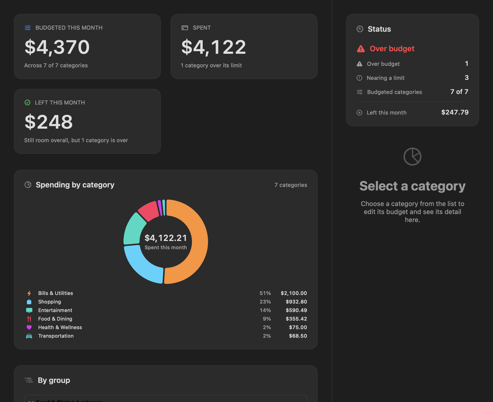
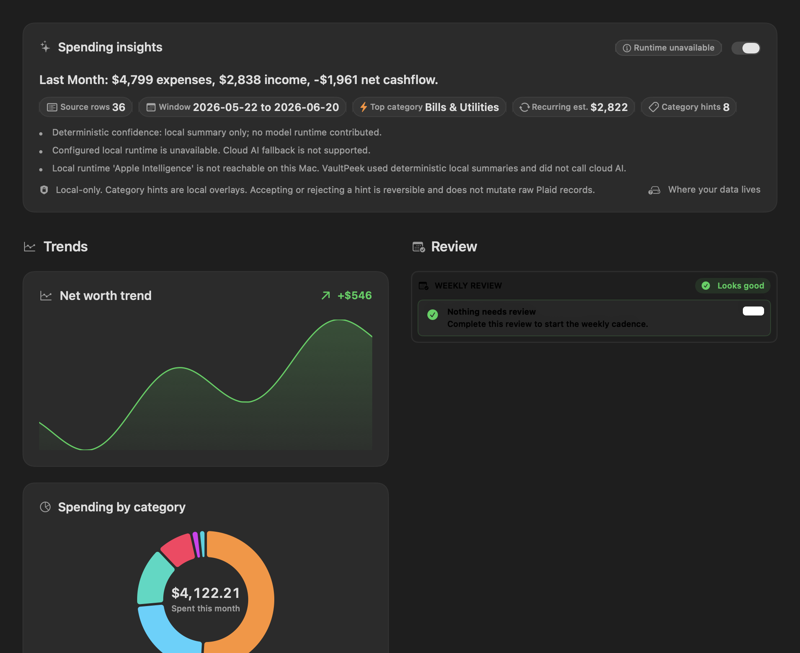
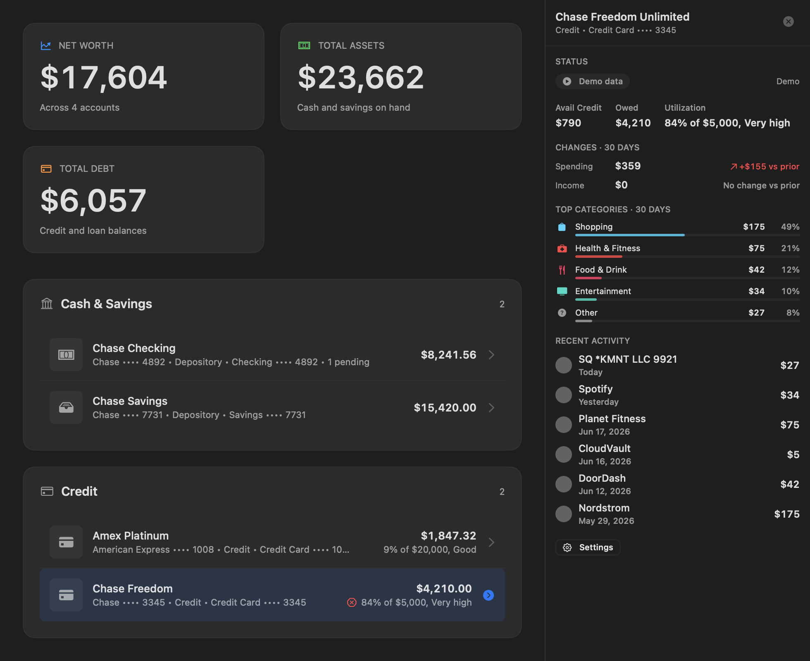

<p align="center">
  
</p>

<h1 align="center">VaultPeek</h1>

<p align="center">
  <strong>Private finance, one glance away.</strong>
</p>

<p align="center">
  Your bank accounts, credit cards, and spending — always one click away in the macOS menu bar.
</p>

<p align="center">
  <a href="https://github.com/ftchvs/VaultPeek/actions/workflows/ci.yml"></a>
  <a href="https://github.com/ftchvs/VaultPeek/blob/main/LICENSE"></a>
  
  
</p>

---

VaultPeek (formerly PlaidBar) is a macOS menu bar dashboard for [Plaid](https://plaid.com) data. It is designed in the spirit of tools like RepoBar and CodexBar: keep the high-signal numbers one click away, stay native to macOS, and avoid a hosted backend.

**No cloud. No telemetry. All data stays local.**

## Why VaultPeek?

Personal finance data lives behind bank website logins. The closest thing to a menu bar finance app was [Balance](https://balancemy.money/) — commercial and now defunct. VaultPeek fills that gap as a privacy-first, local-only product.

- **Menu bar first** — A RepoBar-style popover with a 365-day heatmap, dense finance rows, and fast account drill-down
- **Glanceable label** — Choose whether the menu bar shows net cash, total cash, credit utilization, recent spend, or icon-only, with a compact health signal on the icon
- **Dashboard overview** — One surface for cash, credit, savings, debt, sync health, and selected-account details
- **Inline account drill-down** — Click any row to expand balances, utilization, pending activity, inflow/outflow, recent transactions, and reconnect/refresh actions in place
- **Status-rich filtering** — Switch between All, Cash, Credit, Savings, Debt, and a recovery-oriented Status panel without leaving the primary popover
- **Recurring Detection** — Automatic identification of subscriptions and recurring charges with monthly total
- **Spending Activity** — GitHub-style daily heatmap with Spend/Net modes, bidirectional Income/Outflow color keys, trend line, income vs expense views, and month-over-month comparison
- **Credit Utilization** — Progress bars with configurable warning thresholds and gauge
- **Smart Notifications** — Alerts for large transactions, low balances, and high credit utilization
- **Balance History** — Sparkline showing net balance trend over time
- **Local Insight Receipt** — Optional, local-only activity summary with source-row counts, time window, top category, recurring estimate, and explicit no-cloud fallback when no local AI runtime is configured
- **Attention Queue** — Prioritized recovery prompts keep setup, server, notification, stale-sync, and item-login work visible without hiding the dashboard
- **Diagnostics** — Popover status strip plus a dashboard readiness panel for server health, credential state, synced item count, active local data path, item recovery, and settings handoff
- **Keyboard Shortcuts** — Cmd+R to refresh and Cmd+N to add an account
- **Settings Persistence** — Preferences saved across launches
- **Launch at Login** — Optional auto-start via macOS Login Items
- **Update Check Surface** — About tab includes Sparkle-backed update plumbing;
  signed appcast distribution is still planned
- **Sandbox Mode** — Test the real Plaid sandbox flow before using production credentials
- **Demo Mode** — Render screenshot/demo data without hitting Plaid
- **Private** — Everything stored locally on your Mac, period

## Screenshots

VaultPeek is window-first: the primary experience is a `NavigationSplitView`
workspace (Dashboard, Transactions, Budgets, Planning, Goals, Review Inbox,
Insights, Alerts, Accounts, Settings), with the menu bar retained as a reduced
glance-and-route surface. The captures below are the window-first workspaces
rendered from demo data in light mode.

### Dashboard

<p align="center">
  
</p>

The Dashboard workspace answers the common questions first: net worth, safe to
spend, recent spend, the last year of activity, account health, recurring
charges, and spending by category — all in one window. Local-only insight
receipts are surfaced without sending private transactions to a cloud model.

### Workspaces

| Transactions | Budgets |
|--------------|---------|
|  |  |
| Search, filter, and review the full transaction ledger with category badges and per-row review status. | Track budgeted vs spent by category and group, with over-budget and nearing-limit status and a per-category detail pane. |

| Insights | Accounts |
|----------|----------|
|  |  |
| Local-only spending summaries, trends, and a weekly review cadence — deterministic, with no raw transactions sent to any cloud model. | Browse cash, savings, and credit accounts with a master/detail pane for balances, utilization, 30-day changes, and recent activity. |

Generate fresh window-first screenshots from demo data:

```bash
swift run PlaidBar --demo --render-window-first <output-dir> --appearance light
```

This renders the window-first workspaces headlessly (no Plaid, no server, no
credentials) as `window-*.png` into `<output-dir>`. The named synthetic stories
behind the demo data are documented in [Demo Scenarios](docs/demo-scenarios.md),
including fixture intent and expected status/recovery state.

## Launch status (public beta)

VaultPeek is a **free, local-first public beta**. The product is real and in
daily use, but a few capabilities are intentionally not in this release — so you
know exactly what you are trying before you install.

**What works today**

- The full menu bar dashboard on **demo data** (`swift run PlaidBar --demo`) — no
  account, no bank, no signup.
- **Bring-your-own-Plaid-keys**: connect real or sandbox banks with your own
  Plaid credentials. Account data and access tokens stay stored locally on your
  Mac.

**What is deferred (not in this beta)**

- **Managed / turnkey bank linking** — connecting banks *without* your own Plaid
  keys requires a small hosted service and is deliberately not shipped yet.
- **Paid plans and subscriptions** — VaultPeek is free during the beta; there are
  no accounts to create and no billing.
- **Notarized distribution and auto-update** — builds are ad-hoc-signed
  drag-install DMGs (right-click → **Open** on first launch). Developer ID
  signing, notarization, and Sparkle auto-update are on the roadmap.

**What leaves your Mac**

Nothing, except the bank calls you make yourself. VaultPeek runs no servers of
its own, collects no telemetry, and has no hosted backend. In BYO-keys mode the
only network traffic is from your Mac directly to Plaid using your credentials.
In pure demo mode there are no Plaid or external network calls; local AI runtime
features can still call localhost services if configured.

Support and recovery
guidance is in [SUPPORT.md](SUPPORT.md) and the
[support runbook](docs/support-runbook.md).

## Quick Start

### DMG (easiest, no developer tools)

Build a drag-install disk image from a checkout (or download one from a
GitHub release once published):

```bash
./Scripts/package-dmg.sh
open .build/VaultPeek-*.dmg
```

Then drag **VaultPeek.app** to **Applications** and launch it. On first
launch, right-click VaultPeek.app and choose **Open** (the build is ad-hoc
signed; Developer ID notarization is on the roadmap).

> **Upgrading from PlaidBar?** Installing VaultPeek.app does **not** remove an
> existing `/Applications/PlaidBar.app`. Delete the old app before launching
> VaultPeek — both builds share the same bundle identifier and local server
> port (8484), so running both causes launch and port contention. Local data
> migrates automatically; see
> [docs/release-notes.md](docs/release-notes.md) for details.

The app starts its bundled companion server automatically — no terminal
needed. Before Plaid credentials exist the server runs in a *setup state*:
it boots, reports status, and the dashboard shows "Plaid credentials
missing", while Plaid-backed requests return a clear 503 instead of a
generic failure. To see demo data without any Plaid setup, choose **Demo**
on the setup screen — no server or credentials needed.

To use real or sandbox Plaid data, add your credentials to
`~/.vaultpeek/server.conf`:

```bash
mkdir -p ~/.vaultpeek && chmod 700 ~/.vaultpeek
cat > ~/.vaultpeek/server.conf <<'EOF'
PLAID_CLIENT_ID=your_client_id
PLAID_SECRET=your_secret
# optional: PLAID_ENV=sandbox
EOF
chmod 600 ~/.vaultpeek/server.conf
```

No restart dance required: the app notices the new credentials on its next
status check (any "check again"/refresh action, or the periodic background
refresh) and restarts its bundled server with them. Quitting and reopening
VaultPeek works too.

The app also enforces owner-only permissions on `server.conf` and the server
log at launch. App-managed launches always bind the app's own port, so
`PLAIDBAR_SERVER_PORT` or `PLAIDBAR_DATA_DIR` lines in `server.conf` are not
supported there — set those as environment variables instead so the app and
the server agree.

### Installation

VaultPeek is a proprietary product. Public Homebrew tap distribution has been
discontinued; signed builds are distributed privately to licensed users. The
drag-install DMG installs `VaultPeek.app`; source/developer command examples
below assume you are running from a checkout.

Run local demo data without Plaid credentials:

```bash
swift run PlaidBar --demo
```

Available source/developer commands:

| Command | Purpose |
|---------|---------|
| `swift run PlaidBar --demo` | Launch the menu bar app with local fixture data |
| `swift run plaidbar-cli status --json` | Query the running local server with agent-friendly JSON output |
| `swift run plaidbar-cli item list` | List linked Plaid Items stored by PlaidBarServer |
| `swift run plaidbar-cli balance` | Fetch current balances through PlaidBarServer |
| `swift run plaidbar-cli transactions list --count 5` | Fetch recent transaction updates through PlaidBarServer |
| `swift run plaidbar-cli link --no-open --json` | Create a Hosted Link URL without opening a browser |
| `swift run PlaidBarServer --sandbox` | Start the local Plaid companion server in sandbox mode |
| `swift run PlaidBarServer --version` | Print the installed VaultPeek version |

The `PlaidBar`, `PlaidBarServer`, and `plaidbar-cli` SwiftPM product names are
intentionally unchanged until the staged product rename lands. Source checkouts
also include `Scripts/vaultpeek-run` and the deprecated `Scripts/plaidbar-run`
alias for local sandbox testing, but those helper scripts are not installed by
the DMG.

### Naming compatibility (PlaidBar → VaultPeek)

VaultPeek is the product name. The PlaidBar name intentionally survives in a
few technical surfaces for compatibility, and those are not bugs:

| Surface | Still PlaidBar | Why |
|---------|----------------|-----|
| SwiftPM targets/products | `PlaidBar`, `PlaidBarServer`, `PlaidBarCore`, `plaidbar-cli`; app-bundle executables `PlaidBar`, `PlaidBarServer` | Staged rename; avoids breaking builds, scripts, and bundled server launches at once |
| Environment variables / config keys | `PLAID_*` plus `PLAIDBAR_SERVER_PORT`, `PLAIDBAR_DATA_DIR`, `PLAIDBAR_MIGRATE_LEGACY_DATABASE`, `PLAIDBAR_SMOKE_PORT` | Existing `server.conf` files and shell setups keep working |
| Keychain service | `PlaidBar.PlaidAccessToken` | SQLite `keychain:<item_id>` references must keep resolving after the storage migration |
| SQLite store filenames | `plaidbar-sandbox.sqlite`, `plaidbar-production.sqlite` | Renaming live database files is riskier than keeping them |
| Legacy data directory | `~/.plaidbar/` | Migration source; left in place as rollback evidence (default is now `~/.vaultpeek/`) |
| GitHub repository | `github.com/ftchvs/VaultPeek` | Repo rename has landed; old `ftchvs/PlaidBar` URLs should redirect to this slug |

Rename history and upgrade guidance live in
[docs/release-notes.md](docs/release-notes.md) and [CHANGELOG.md](CHANGELOG.md).

In source/developer builds, `plaidbar-cli` follows the official Plaid CLI's
terminal/agent conventions where they fit VaultPeek: table output by default,
`--json` for structured stdout, diagnostics on stderr, and local-server bearer
auth from `~/.vaultpeek/auth-token` or `$PLAIDBAR_DATA_DIR/auth-token`. It does
not read Plaid Dashboard credentials directly; Plaid secrets and access tokens
stay in `PlaidBarServer`.

Run Plaid sandbox mode from a source checkout:

```bash
export PLAID_CLIENT_ID=your_sandbox_client_id
export PLAID_SECRET=your_sandbox_secret
./Scripts/run.sh --sandbox
```

### Source build (licensed access only)

Building from source requires authorized access to this private repository.

```bash
git clone https://github.com/ftchvs/VaultPeek.git
cd VaultPeek
swift build
```

### 2. Run in sandbox mode

```bash
export PLAID_CLIENT_ID=your_sandbox_client_id
export PLAID_SECRET=your_sandbox_secret
./Scripts/run.sh --sandbox
```

This starts both the local server and the menu bar app with Plaid's sandbox environment. Sandbox uses demo bank institutions and demo balances/transactions from Plaid, but it still requires Plaid sandbox credentials.

If you only need static UI screenshots without Plaid credentials, run the app in demo mode:

```bash
swift run PlaidBar --demo
```

### 3. Click the VaultPeek icon in your menu bar

First run now asks you to choose a data source:

- **View Demo** loads local fixture accounts and transactions. It does not call Plaid and does not require credentials.
- **Connect Sandbox** opens Plaid Link only when the local server is running in sandbox mode with sandbox credentials.
- **Use Production Credentials** opens the same connect flow only when the local server reports production mode. Production uses real account data and requires Plaid approval.

Before Plaid Link opens, the app explains that Plaid item records and synced account data are stored locally under `~/.vaultpeek/`, Plaid access-token bytes are kept in macOS Keychain when available, and Plaid credentials remain in the local server environment. Existing default `~/.plaidbar/` installs are copied into `~/.vaultpeek/` without overwriting newer files.

### 4. Use with real bank data (optional)

```bash
export PLAID_CLIENT_ID=your_client_id
export PLAID_SECRET=your_secret
./Scripts/run.sh
```

Get credentials free at [dashboard.plaid.com](https://dashboard.plaid.com). Sandbox credentials can be used immediately; production requires Plaid approval.

You can also keep server settings in a local key-value config file and pass it
to the standalone server:

```bash
mkdir -p ~/.vaultpeek
cat > ~/.vaultpeek/server.conf <<'EOF'
PLAID_CLIENT_ID=your_client_id
PLAID_SECRET=your_secret
PLAID_ENV=sandbox
PLAIDBAR_DATA_DIR=~/.vaultpeek
EOF
chmod 600 ~/.vaultpeek/server.conf

swift run PlaidBarServer --config ~/.vaultpeek/server.conf
```

The config file uses the same keys as the environment. Values in the config
file override the process environment; explicit CLI flags like `--port` and
`--sandbox` override both.

If the config file sets `PLAIDBAR_SERVER_PORT` or `PLAIDBAR_DATA_DIR` to a
non-default value, export the same values before launching VaultPeek so the app
connects to the right port and reads the same local auth token.

> **Keep `PLAIDBAR_DATA_DIR` local.** The private data directory holds the
> SQLite stores, the local auth token, and the disposable, rebuildable,
> per-environment JSON read-model cache (default `~/.vaultpeek/`, which is
> local). VaultPeek's "local-only" framing assumes that directory stays
> on-device. If you point `PLAIDBAR_DATA_DIR` at a cloud-synced folder (iCloud
> Drive, Dropbox, OneDrive, a synced network share, etc.), that sync client can
> copy those files off-device — including the read-model cache, which holds
> derived financial data such as balances, merchant names, and amounts (though
> never Plaid secrets or Keychain material). Production macOS builds keep Plaid
> access-token bytes in non-synchronizable Keychain items; fallback builds
> without usable Keychain support can store token bytes in SQLite under
> `PLAIDBAR_DATA_DIR`. Widgets and App Intents use separate App Group glance
> snapshots that can contain derived finance values, so keep App Lock and
> Privacy Mask enabled when those surfaces should stay redacted.

## Data Modes

| Mode | Command | Plaid network calls | Data source | Intended use |
|------|---------|---------------------|-------------|--------------|
| Demo | `swift run PlaidBar --demo` | No | Hardcoded local fixtures | Screenshots and UI review |
| Sandbox | `./Scripts/run.sh --sandbox` | Yes, sandbox API | Plaid sandbox credentials | Public demo and development |
| Production | `./Scripts/run.sh` | Yes, production API | Your Plaid-approved credentials | Personal use after Plaid approval |

For a fast sandbox preflight without opening the menu bar app, export sandbox
credentials and run `./Scripts/smoke-sandbox.sh`. It builds the server, starts
it on `127.0.0.1:${PLAIDBAR_SMOKE_PORT:-18484}`, checks `/health`, and verifies
that unauthenticated `/api` calls are rejected before checking `/api/status`
with the generated local bearer token. It then restarts the server against the
same data directory to verify restart recovery (same auth token, same readiness
state), and boots a second credential-less server on
`127.0.0.1:${PLAIDBAR_SMOKE_SETUP_PORT:-18485}` to verify the setup state:
`credentialsConfigured=false` on `/api/status` and a 503 on Plaid-backed routes
whose body names the missing `PLAID_CLIENT_ID`/`PLAID_SECRET` variables. The
smoke script uses temporary data directories by default; set
`PLAIDBAR_DATA_DIR` when you intentionally want to point it at a specific local
store.

### Sandbox limitations

Sandbox mode exercises the full local pipeline — server startup, local auth,
Plaid Link, transaction sync, storage permissions — against Plaid's test
institutions only. Passing sandbox (including the smoke script) does not
demonstrate production readiness: production requires Plaid production
approval, separate production credentials, and connects real financial data.
Sandbox and production keep strictly separate SQLite stores and caches
(`plaidbar-sandbox.sqlite` vs `plaidbar-production.sqlite`) in the same data
directory, so switching modes never mixes test data with real data — and also
means each mode starts empty until linked in that mode.

## Keyboard Shortcuts

| Shortcut | Action |
|----------|--------|
| `Cmd+R` | Refresh balances and sync transactions |
| `Cmd+N` | Add account |

## Accessibility

Accessibility expectations for keyboard navigation, VoiceOver labels, charts,
status indicators, and screenshots are in [ACCESSIBILITY.md](ACCESSIBILITY.md).

## Requirements

| Requirement | Version |
|------------|---------|
| macOS | 26.0 (Tahoe)+ |
| Swift | 6.0+ |
| Xcode | 26+ (or Swift toolchain) |
| Plaid account | Free for sandbox |

## Architecture

VaultPeek uses a **two-process architecture** — a SwiftUI menu bar app talks to a local companion server that proxies all Plaid API calls.

```
┌─────────────────────────────────────┐
│  VaultPeek.app (SwiftUI)            │
│  MenuBarExtra · Swift Charts        │
│  Accounts · Transactions · Spending │
└──────────────┬──────────────────────┘
               │ HTTP (localhost:8484)
┌──────────────▼──────────────────────┐
│  PlaidBarServer (Hummingbird 2)     │
│  Plaid API proxy · Fluent/SQLite    │
│  Token storage · OAuth callback     │
└──────────────┬──────────────────────┘
               │ HTTPS
┌──────────────▼──────────────────────┐
│  Plaid API                          │
│  /accounts · /transactions/sync     │
└─────────────────────────────────────┘
```

**Why a companion server?** Plaid requires that `client_secret` and `access_token` never exist in the menu bar client. The server:
1. Keeps Plaid credentials and access tokens out of the SwiftUI app process
2. Stores item records in local SQLite and Plaid access-token bytes in macOS Keychain when available
3. Binds to `127.0.0.1` only — no LAN or cloud exposure
4. Can be restarted independently of the UI
5. Powers the source-built `plaidbar-cli` while keeping terminal access behind the
   same local auth and server boundaries

### Technology Stack

| Layer | Technology | Why |
|-------|-----------|-----|
| Menu bar app | SwiftUI `MenuBarExtra` (.window) | Native macOS, modern API |
| Charts | Swift Charts | Built-in, no dependencies |
| Design system | Semantic tokens + 8pt grid | Consistent, maintainable |
| Local server | [Hummingbird 2](https://github.com/hummingbird-project/hummingbird) | Lightweight, SwiftNIO-based, same language as app |
| Database | SQLite via [Fluent ORM](https://github.com/vapor/fluent-kit) | Migrations, queries, Hummingbird-native |
| Plaid access-token vault | macOS Keychain + SQLite references | Keep token bytes out of the SwiftUI app and out of normal SQLite rows at runtime |
| Update plumbing | [Sparkle 2](https://github.com/sparkle-project/Sparkle) | Standard updater framework; appcast distribution remains planned |
| Launch at login | SMAppService | Native macOS Login Items API |

### Project Structure

```
PlaidBar/                            # repo checkout (repo rename pending)
├── Sources/
│   ├── PlaidBar/                    # macOS menu bar app
│   │   ├── App/                     # @main entry, AppState
│   │   ├── Theme/                   # Design tokens, typography
│   │   ├── Views/                   # Dashboard popover, setup, settings surfaces
│   │   │   ├── MainPopover.swift    # Dashboard-first menu bar popover
│   │   │   ├── DashboardNavBand.swift # Cash/Credit/Savings/Debt/Status filters
│   │   │   ├── AccountDetailFlyout.swift # Per-account drill-in fly-out
│   │   │   ├── AttentionQueueView.swift # Degraded-item recovery surface
│   │   │   ├── SetupView.swift      # Onboarding flow
│   │   │   └── Charts/             # Chart components
│   │   ├── Models/                  # Local cache models
│   │   ├── Services/                # HTTP client, refresh, launch
│   │   └── Settings/                # Preferences window
│   ├── PlaidBarWidgetExtension/     # Widget + Control Center control + App Intents (App Group glance surfaces)
│   ├── PlaidBarServer/              # Local companion server
│   │   ├── Routes/                  # REST endpoints
│   │   ├── Plaid/                   # Plaid API client + models
│   │   ├── Storage/                 # Fluent models + migrations
│   │   └── Config/                  # Server configuration
│   ├── PlaidBarCLI/                 # plaidbar-cli — command-line access to the local server
│   ├── PlaidBarCore/                # Shared library
│   │   ├── Models/                  # DTOs, dashboard presenters, local AI receipts, routes, goals
│   │   └── Utilities/               # Currency formatters, constants, reducers
│   └── PlaidBarCache/               # App-only disposable file-backed read-model cache
├── Tests/                           # Swift Testing suites for the app, server, core, and cache libraries
├── Scripts/                         # build.sh, run.sh, screenshots.sh
├── Assets/                          # README screenshots
├── DESIGN.md                        # Design system spec
├── PRD.md                           # Product requirements
├── .github/workflows/ci.yml        # GitHub Actions CI
├── Package.swift                    # SPM with 6 source targets (app, widget extension, server, CLI, core, app-only file-backed cache)
└── LICENSE                          # Proprietary
```

## Plaid API Usage

VaultPeek uses these Plaid endpoints:

| Endpoint | Feature | Cost | Frequency |
|----------|---------|------|-----------|
| `/link/token/create` | Account setup | Free | On-demand |
| `/item/public_token/exchange` | Account setup | Free | Once per bank |
| `/accounts/get` | Cached balances | Free | ≤ Twice a day (default) or manual |
| `/accounts/balance/get` | Real-time balances | Per-request | Manual refresh |
| `/transactions/sync` | Transactions | Per-item | ≤ Twice a day (default) or manual |

Rate limits are well within Plaid's allowances for personal use — automatic refresh is capped at roughly twice a day per item by default, plus on-demand manual refreshes.

## Security

| Concern | How VaultPeek handles it |
|---------|------------------------|
| Plaid secrets | Read from environment variables at server startup, never embedded in the app binary |
| Plaid access tokens | Stored in macOS Keychain at runtime when available; SQLite stores `keychain:<item_id>` references |
| Local status endpoint | Authenticated `/api/status` exposes readiness metadata only, not tokens, account IDs, balances, or transactions |
| Network exposure | Server binds to `127.0.0.1` only |
| App ↔ Server auth | Shared token generated at first run |
| Data at rest | macOS encrypted APFS volume |
| Distribution | Privately-distributed, ad-hoc-signed DMG; notarized app distribution remains post-1.0 until signing is real |

**VaultPeek has no cloud backend, no analytics, no telemetry, and no tracking.** Your financial data never leaves your machine.

Do not share real Plaid credentials, access tokens, account IDs, screenshots with balances, or bank transaction exports in issues, pull requests, or support channels. See [SECURITY.md](SECURITY.md) for responsible disclosure and local data handling notes.

## Development

```bash
# Build all targets
swift build

# Build release
swift build -c release

# Run source/developer commands
swift run PlaidBar --demo
swift run PlaidBarServer --sandbox

# Run source-checkout helper scripts
./Scripts/vaultpeek-run --sandbox   # plaidbar-run remains a deprecated alias

# Run tests
swift test

# Run server standalone
swift run PlaidBarServer --sandbox

# Run server with a local config file
swift run PlaidBarServer --config ~/.vaultpeek/server.conf

# Run server/app on a custom localhost port
PLAIDBAR_SERVER_PORT=9494 ./Scripts/run.sh --sandbox

# Run both (server + app)
./Scripts/run.sh --sandbox

# Smoke-test sandbox server status
./Scripts/smoke-sandbox.sh

# Capture screenshots (demo mode)
./Scripts/screenshots.sh

# First-time setup helper
./Scripts/setup.sh
```

See [CONTRIBUTING.md](CONTRIBUTING.md) for internal development conventions (code style, architecture, build/test gates). VaultPeek is a proprietary product and does not accept public contributions.

See [GOAL.md](GOAL.md) for the RepoBar/CodexBar-style product direction, design principles, and implementation priorities.

Additional project docs:

- [Architecture](docs/architecture.md)
- [Privacy](docs/privacy.md)
- [Troubleshooting](docs/troubleshooting.md)
- [Screenshots](docs/screenshots.md)
- [QA Matrix](docs/qa-matrix.md)
- [Support Policy](SUPPORT.md)
- [Release Notes Drafts](docs/release-notes.md)
- [Changelog](CHANGELOG.md)

### Agentic Development Loop

This repo includes a local slash-command style runbook for long-running
production-readiness work:

```bash
/goal
```

The entrypoint lives in [`commands/goal.md`](commands/goal.md) and delegates to
[`commands/vaultpeek-prod-loop.md`](commands/vaultpeek-prod-loop.md) for the full
multi-hour loop. It is designed for focused production-readiness work around
the menu bar dashboard, trust, onboarding, local data controls, diagnostics,
and empty/error states.
Repo-local Codex skills in `.codex/skills/` provide companion instructions for
commit, push, review, and production-readiness work.

## Server API Reference

The companion server exposes these localhost endpoints. `/health` and
`/oauth/callback` are unauthenticated; `/api/*` requires the local bearer token
stored under `~/.vaultpeek/auth-token` or `PLAIDBAR_DATA_DIR/auth-token`.
Plaid Link completion callbacks must also include the one-time `state` generated
when the local app created the Hosted Link session.

| Method | Endpoint | Description |
|--------|----------|-------------|
| `GET` | `/health` | Health check |
| `GET` | `/api/status` | Readiness metadata only: server version, environment, item/synced counts, last sync, credential/storage readiness; no secrets, account IDs, balances, transactions, Plaid tokens, or raw payloads |
| `GET` | `/api/items` | List connected bank items |
| `POST` | `/api/link/create` | Create one-time Plaid Hosted Link token + URL |
| `POST` | `/api/link/update/:itemId` | Create one-time Plaid Hosted Link update-mode URL for reconnect |
| `GET` | `/oauth/callback` | Plaid Hosted Link completion redirect handler |
| `GET` | `/api/accounts` | List all accounts (cached) |
| `GET` | `/api/accounts/balances` | Real-time balances |
| `DELETE` | `/api/accounts/:itemId` | Remove a bank connection |
| `GET` | `/api/transactions/sync` | Incremental transaction sync |
| `GET` | `/api/budgets` | List saved category budgets (display-safe monthly limits only) |
| `PUT` | `/api/budgets/:category` | Upsert a category's monthly limit (body `{ "monthlyLimit": Double }`); income/transfer categories are rejected |
| `DELETE` | `/api/budgets/:category` | Remove a category's budget |
| `GET` | `/api/review` | Pull the opt-in synced review-state snapshot (overrides + rules); empty unless the user enabled server-synced review. Display-safe values only — no Plaid tokens |
| `PUT` | `/api/review` | Upload a device review-state snapshot; the server merges it (per-record last-writer-wins) and returns the union. Opt-in only |
| `DELETE` | `/api/review` | Clear all synced review state (opt-out / reset) |

> `/api/review` is the **opt-in** server-synced review surface (AND-552). It is
> off by default (`ServerSyncedReviewFeatureFlag`); with sync off nothing is sent
> or stored and behavior is byte-identical to local-first. See `SECURITY.md` for
> the trust-boundary change (the server then stores user category overrides).

## Roadmap

VaultPeek is a local-first macOS menu bar finance instrument: high-signal
numbers one click away, with all data staying on your machine. Work is split
into small, defensible implementation slices around the menu bar dashboard,
trust, onboarding, local data controls, diagnostics, and empty/error states.

Near-term release priorities:

- [x] Merge readiness, recovery, screenshot, and metadata work
- [x] Complete first-run demo/sandbox/production setup QA
- [x] Add architecture, privacy, troubleshooting, and changelog docs
- [x] Finish security and local-data audit for 1.0
- [x] Decide 1.0 packaging shape: drag-install DMG (Homebrew formula retired)
- [x] Verify release metadata from clean `main`

Post-1.0 priorities:

- [ ] Tighten the dashboard into a more compact RepoBar-style finance
      instrument
- [ ] Build on Liquid Glass as the macOS 26 baseline surface treatment (no
      material fallback path)
- [ ] Converge dashboard/settings recovery actions for server, Plaid item,
      empty-data, stale-sync, and notification-permission states
- [ ] Add local AI summaries for financial activity over the last 7 days, last
      month, and year-over-year windows without sending transaction data to
      cloud models
- [ ] Use local AI to suggest smarter expense and income categories while
      preserving Plaid categories as the auditable fallback
- [ ] Refresh screenshots and QA evidence after visual changes

Deferred product candidates:

- [ ] Budget alerts per category
- [ ] Multi-currency support
- [ ] Investment account tracking (Plaid Investments)
- [x] CSV/JSON export for tax/accounting (Settings → Local data → Export & Backup)
- [ ] Webhook support for real-time updates
- [ ] Dark/light theme customization
- [ ] [Teller](https://teller.io/) as alternative provider

## Inspiration

- [RepoBar](https://github.com/steipete/RepoBar) — GitHub repo status in the macOS menu bar
- [Balance](https://balancemy.money/) — Commercial macOS finance app (defunct)
- [Cashculator](https://cashculator.app/) — Personal finance for Mac

## License

Proprietary — Copyright © 2026 [Felipe Tavares Chaves](https://github.com/ftchvs). All rights reserved. See [LICENSE](LICENSE). No use, copying, or distribution without a written agreement from the owner.
