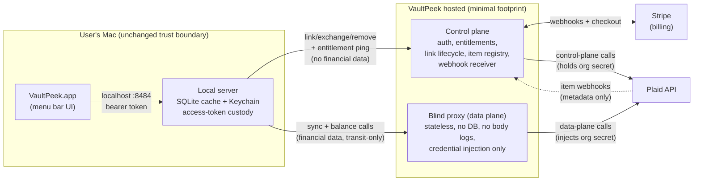
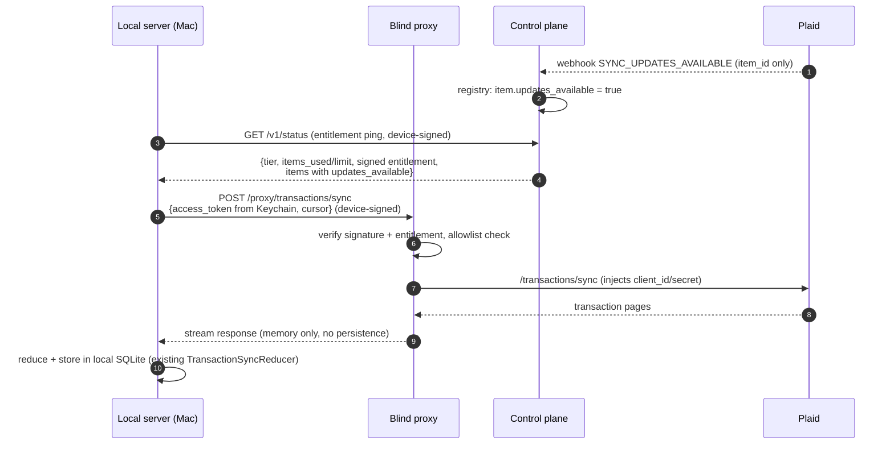
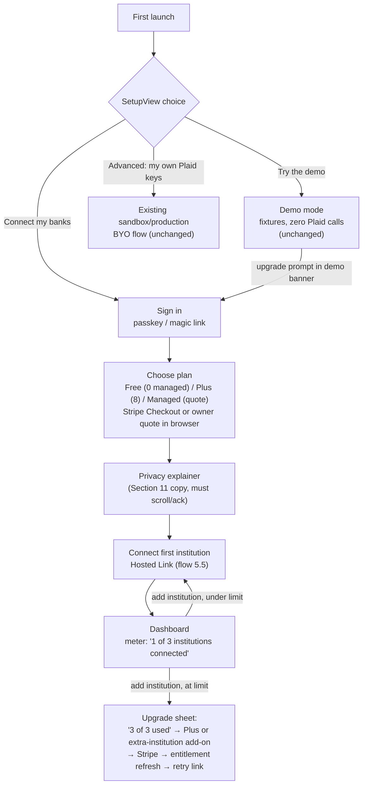

# Managed Bank-Link Backend Architecture

**Design document only. Nothing in this document authorizes implementation.** AND-347 requires an explicit go/no-go decision (Section 13) before any hosted backend behavior is built. All pricing figures are labeled with retrieval date; anything not from an official price list is marked **estimate**.

---

## 1. Summary

VaultPeek today is a strictly local two-process app: a SwiftUI menu bar client and a localhost Hummingbird server that owns the user's *own* Plaid credentials. The consumer opportunity is **managed bank linking**: the user signs in, picks a plan, and connects a bank — no Plaid developer account, no API keys, no security questionnaire.

This document designs the minimal hosted footprint that makes that possible, and is honest about the central architectural fact:

> **With Plaid, every data-plane API call requires VaultPeek's `client_id` + `secret`.** A managed model where the user holds no credentials therefore cannot keep the hosted service entirely out of the data path. The best achievable posture is: **zero hosted storage of financial data, transit-only through a stateless "blind proxy," with the access token custodied on the user's device.** That is a weaker promise than today's "no hosted backend" — Section 4 treats this tension as a first-class design constraint, not a footnote.

**Recommendation (Section 13): Build small, but defer behind explicit gates.** The broker is genuinely minimal (~6 control-plane endpoints + one stateless proxy), but Plaid's 2026 Trial plan makes BYO-keys free for personal use (10 Items), which weakens the urgency. Ship the design, validate demand and a real Plaid quote first.

---

## 2. Context: what exists today (code as of 2026-06-12)

Grounded in the worktree at `Sources/` (paths relative to repo root):

| Concern | Today (BYO-keys, local-only) | Code |
|---|---|---|
| Link session creation | Local server calls `/link/token/create` with the **user's own** `client_id`/`secret`, using Plaid **Hosted Link** with a 30-minute URL lifetime and a localhost completion redirect | `Sources/PlaidBarServer/Plaid/PlaidClient.swift` (`createLinkToken`), `Sources/PlaidBarServer/Routes/LinkRoutes.swift` |
| CSRF/state validation | One-time `state` UUID, 30-min TTL, persisted with 0600/0700 permissions, consumed exactly once at `/oauth/callback` | `Sources/PlaidBarServer/Auth/PendingLinkSessionStore.swift` |
| Public-token exchange | Local server calls `/item/public_token/exchange` (single-attempt retry policy — no double exchange) | `PlaidClient.exchangePublicToken`, `OAuthCallbackRoute.exchangeAndStore` |
| Access-token storage | Token **bytes** in macOS Keychain; SQLite stores only a `keychain:<item_id>` reference | `Sources/PlaidBarServer/Storage/TokenStore.swift`, `Storage/PlaidTokenVault.swift` |
| Sync | Local server polls `/transactions/sync` (cursor in local SQLite); the app's `RefreshService`/`SyncService` drive cadence. **No webhooks today** — pure polling | `PlaidClient.syncTransactions`, `Sources/PlaidBar/Services/SyncService.swift` |
| Disconnect | `/item/remove` (single-attempt), then Keychain token deletion + orphan pruning | `PlaidClient.removeItem`, `TokenStore.deleteItem`, `TokenStore.pruneOrphanedKeychainTokens` |
| Credential-less boot | Server boots without credentials into a "setup state"; Plaid routes 503 until `server.conf` exists | `Sources/PlaidBarServer/Config/ServerConfig.swift` (`credentialsConfigured`) |
| Onboarding UI | `SetupView` offers Demo / Sandbox / Production; Demo runs on fixtures with zero Plaid calls | `Sources/PlaidBar/Views/SetupView.swift` |

Two properties of the current code materially de-risk the managed design:

1. **Hosted Link is already the link UX.** The app opens a browser to Plaid's hosted flow; the only thing that changes in managed mode is *who mints the link token and where the completion redirect lands*. No embedded Link SDK work.
2. **Token custody discipline already exists.** `PlaidTokenVault` already treats access tokens as Keychain-only bytes. Device custody of managed tokens (Section 5.3, Variant 1) is an extension of an existing pattern, not a new invention.

---

## 3. Goals and non-goals

**Goals**

- A non-technical user can connect a bank with zero Plaid credentials, gated by plan entitlement (AND-350).
- Hosted footprint stores the **minimum necessary data**: identity, entitlement, item registry. Never transactions, balances, account numbers, or holdings (AND-347).
- The Mac app + local cache remain the primary experience; the hosted service is a *bridge*, and the app keeps working offline against cached data.
- Full lifecycle coverage: link session creation, public-token exchange, access-token custody, sync, webhooks, disconnect/removal (AND-347 acceptance criteria).
- Demo mode survives untouched, with zero live provider cost (AND-350).

**Non-goals (this document)**

- Pricing strategy (separate doc; figures here are COGS inputs only).
- Teller integration design (separate doc; referenced as an alternative in Section 13).
- Multi-device sync, web dashboard, or any hosted rendering of financial data.
- Implementation plans, schemas-as-migrations, or API contracts beyond sketch level.

---

## 4. The local-first tension (read this first)

VaultPeek's published promise: **no cloud backend, no telemetry, all data stays on the user's machine.** Managed linking cannot fully preserve that promise. Precisely what breaks, and what does not:

| Promise component | BYO-keys today | Managed tier (this design) |
|---|---|---|
| No hosted backend at all | True | **Broken.** A hosted broker exists (entitlement + link lifecycle). |
| Financial data never *stored* off-device | True | **Preserved.** Broker stores identity/entitlement/item registry only. |
| Financial data never *transits* a VaultPeek server | True | **Broken — and unavoidable with Plaid.** Data-plane calls need VaultPeek's `secret`; sync responses stream through a stateless proxy (Section 5.4). Transit-only, memory-only, no persistence, no body logging. |
| No telemetry | True | **Preserved with one carve-out:** the entitlement check is a narrowly-scoped ping — `{license_key, app_version, hashed_install_id}` in, `{tier, items_used, items_limit, expires_at, signature}` out. Published in `SECURITY.md`, inspectable like every other localhost interaction. No usage events, no feature analytics, ever. |
| User owns the provider relationship | True (user's Plaid account) | **Broken.** VaultPeek signs Plaid's MSA, completes the security questionnaire, and is the regulated "authorized third party" under the Section 1033 data-access regime (Plaid Developer Policy, retrieved 2026-06-12). Plaid bills VaultPeek per Item regardless of whether data touches our servers. |

Why we cannot do better than transit-only: the obvious "fix" — ship VaultPeek's production `secret` inside the local server so the data plane stays device-to-Plaid — is prohibited by Plaid's policy (secrets must not live in client-distributed software) and is a catastrophic single point of failure: one extracted secret compromises the entire customer base and VaultPeek's Plaid relationship. Rejected unconditionally (Section 5.4, option D1).

**Consequence for positioning:** the managed tier must be marketed with a *different, honest* promise — "we never store your financial data; sync passes through an open-source, auditable relay and is never written down" — while BYO-keys mode remains available and remains the only mode that satisfies the original local-first promise verbatim. Privacy copy in Section 11.

---

## 5. Proposed architecture

### 5.1 Shape: two planes, one tiny hosted service



Hard separation rules:

- **Control plane** may persist data; it never touches a financial payload. Its database contains: users, entitlements, device public keys, and an **item registry** (`user_id`, `item_id`, `institution_id`, `status`, timestamps — nothing else; note `institution_name` is cosmetic and can stay device-side, mirroring today's `TokenStore.saveItem` which already passes `institutionName: nil`).
- **Blind proxy** may touch financial payloads; it never persists anything. No database, no disk volume, request/response bodies stream through memory, logs carry metadata only (timestamp, hashed user id, Plaid endpoint, status code, byte counts). The proxy binary/config is **open-sourced** so the claim is auditable — this is the managed-tier analog of "the localhost server is inspectable."
- The two planes are separate deployables with separate credentials; the control plane cannot read proxy traffic, the proxy cannot read the control-plane DB.

### 5.2 What the hosted service stores (data minimization, AND-347)

| Data | Stored hosted? | Where it lives instead |
|---|---|---|
| Email + auth (passkey or magic link) | Yes (control plane) | — |
| Stripe customer id, subscription state, tier | Yes (control plane) | — |
| Item registry: `item_id`, `institution_id`, status, linked/removed timestamps | Yes (control plane) — required for plan limits, billing hygiene, webhook routing | Mirrored locally in existing `ItemModel` |
| **Plaid access tokens** | **No** (Variant 1, Section 5.3) — exchanged, returned to device, then deleted from broker memory | User's macOS Keychain via existing `PlaidTokenVault` |
| Transactions, balances, account names/numbers/mask, holdings, liabilities | **Never** | Local SQLite cache, as today |
| Sync cursors | No | Local `SyncCursorModel`, as today |
| Audit log (control-plane events only) | Yes (Section 9) | — |

### 5.3 Access-token custody: the one real fork in the design

| | **Variant 1 — Device custody (proposed)** | Variant 2 — Broker vault custody |
|---|---|---|
| Token at rest | User's Keychain only (existing `PlaidTokenVault` path). Broker holds it in memory for seconds during exchange, then discards. | Broker KMS-encrypted vault |
| Broker DB breach exposes | Item registry metadata only — **zero tokens** | All customers' access tokens (+ secret reachable by the same operator) |
| Data-plane request | Device sends its token per request; proxy injects only `client_id`/`secret` | Device sends item ref; proxy injects token *and* secret |
| Multi-device / future web | Hard (token must move via user) | Easy |
| Billing hygiene on lost device | **Weak spot:** `/item/remove` requires the access token; a lost Mac can strand a billing Item | Clean: broker can always remove |
| Local-first alignment | Maximal — extends today's exact pattern | Industry-standard SaaS posture |

**Proposal: Variant 1.** VaultPeek is a single-device product; device custody keeps the broker breach-blast-radius near zero and is the strongest honest privacy claim available. The lost-device billing leak is mitigated, not solved: (a) entitlement expiry/cancellation marks registry items `orphan-pending`; (b) an orphaned Item with no entitled customer is a pure COGS leak (Plaid bills per Item until removed — official billing docs, retrieved 2026-06-12), so the runbook escalates to Plaid support / dashboard item removal; (c) **open question O1 (Section 14):** confirm with Plaid whether items can be administratively removed without the access token. If the answer is no and orphan rates are material, revisit Variant 2 with a documented promise downgrade.

### 5.4 Data plane: options considered

| | Option | Verdict |
|---|---|---|
| D1 | Ship org `secret` in the local server; data plane stays device→Plaid | **Rejected.** Violates Plaid policy; one extraction = total compromise. |
| D2 | **Stateless blind proxy** — device sends `{managed_item_id, access_token, endpoint, params}`; proxy validates entitlement, endpoint allowlist, and that the token is bound to that registered managed Item before injecting `client_id`/`secret` and streaming Plaid's response back; no request/response payload is persisted | **Proposed.** Minimal achievable footprint given D1 is off the table. |
| D3 | Broker runs hosted sync jobs and stores results for the app to pull | **Rejected.** This is a hosted financial database — the thing the product promises not to be. |
| D4 | No managed data plane at all (broker only does link) | **Incoherent.** A managed user with no credentials can link but never fetch; only viable as "defer everything." |

Blind-proxy hard rules (these are the security model, not nice-to-haves):

- **Endpoint allowlist** mirrors exactly what `PlaidClient.swift` calls today for the user's tier: `/transactions/sync`, `/accounts/get`, `/item/remove` (+ recurring/liabilities/investments endpoints if/when tiers include them). `/accounts/balance/get` is not part of the generic sync allowlist; it requires a specific realtime-balance entitlement, a user-initiated call path, and a tighter quota because it can create per-request Plaid COGS. Everything else — `/processor/*`, `/transfer/*`, `/identity/*`, sandbox endpoints in prod — is refused.
- **Managed Item binding** is mandatory on every proxy request. The local server sends the broker `managed_item_id` plus the device-held token; the broker verifies the Item belongs to the license/install, checks the Item is active, and validates the token against a short-lived token hash/fingerprint captured during link exchange before proxying. A token that is not tied to one of the caller's registered managed Items is refused, even if the device key and entitlement are otherwise valid.
- Requests are authenticated with a **device-bound key**: at sign-in the local server generates a keypair, registers the public key with the control plane, and signs proxy requests. A cracked app binary cannot mint entitlements; enforcement lives server-side where it cannot be patched out.
- Per-user rate limits sized to the app's existing polling cadence (`Constants.swift` refresh intervals) — anomalous volume is throttled and flagged.
- No request/response body ever written to disk or log. Metadata-only logs, short retention (30 days).

**Sync jobs stay on-device (AND-347 "sync jobs" coverage).** The existing `SyncService` polling loop, cursor management (`TransactionSyncReducer`, `SyncCursorModel`), and page caps are unchanged — the only difference is the HTTP hop goes through the proxy instead of straight to `production.plaid.com`. The broker schedules nothing.

**Webhooks (AND-347).** Today's architecture has no webhook surface (localhost is unreachable from Plaid). The broker fixes this: it registers a webhook URL at link-token creation, receives Plaid item/transaction webhooks (`SYNC_UPDATES_AVAILABLE`, `ERROR`, `PENDING_EXPIRATION`, `USER_PERMISSION_REVOKED` — these carry `item_id` + codes/counts, not financial payloads), and records a per-item `needs_attention` / `updates_available` flag in the registry. The app picks flags up on its normal entitlement/status poll — no push infrastructure, no new always-on connection from the Mac. Webhook receipt makes polling smarter (sync only when updates exist), which directly reduces proxy traffic.

### 5.5 Managed link flow (sequence)

```mermaid
sequenceDiagram
    autonumber
    participant App as VaultPeek.app
    participant Local as Local server (Mac)
    participant CP as Broker control plane
    participant Plaid as Plaid
    participant B as User's browser

    App->>Local: connect bank (managed mode)
    Local->>CP: POST /v1/link/sessions (device-signed)
    CP->>CP: check entitlement: items_used < items_limit?
    alt over limit
        CP-->>Local: 402 limit_reached {items_used, items_limit}
        Local-->>App: show upgrade sheet (Section 7)
    else entitled
        CP->>Plaid: /link/token/create (org creds, Hosted Link,<br/>redirect → broker HTTPS callback, state)
        Plaid-->>CP: link_token + hosted_link_url
        CP-->>Local: {hosted_link_url, state}
        Local->>B: open hosted_link_url
        B->>Plaid: user authenticates with bank (OAuth)
        Plaid->>CP: GET /link/callback?state=... (one-time state, 30-min TTL —<br/>same semantics as PendingLinkSessionStore today)
        CP->>Plaid: /item/public_token/exchange (single attempt)
        Plaid-->>CP: access_token + item_id
        CP->>CP: registry += {user_id, item_id, institution_id};<br/>token held in memory only
        CP-->>B: success page → redirect vaultpeek://link/complete?session=...
        B->>App: deep link
        Local->>CP: POST /v1/link/sessions/{id}/claim (device-signed)
        CP-->>Local: {access_token, item_id, institution_id} — then broker erases token
        Local->>Local: PlaidTokenVault.store() → Keychain (existing path)
        Local-->>App: "2 of 3 institutions connected"
    end
```

Notes: the broker callback replaces today's `http://localhost:8484/oauth/callback` (Plaid production OAuth requires registered HTTPS redirect URIs — the localhost redirect is a sandbox/BYO affordance). Before managed production link-token creation is enabled, the exact broker HTTPS callback configured as `PLAIDBAR_OAUTH_REDIRECT_URI` must be registered in the Plaid Dashboard for the production application; a mismatch should be treated as a release blocker, not a runtime warning. The one-time-state + TTL + single-attempt-exchange discipline is lifted directly from `PendingLinkSessionStore` and `PlaidClient`'s `.singleAttempt` retry policy. The token-claim handoff is device-signed and single-use; an unclaimed session expires and the broker removes the Item (no orphan billing from abandoned links).

Future app/universal-link callback mode is distinct from the managed broker callback. Plaid OAuth redirect URIs for native app return paths must still be HTTPS Universal Links, registered in the Plaid Dashboard, and backed by Apple Associated Domains plus a valid `apple-app-site-association` file on the callback host. Custom URL schemes such as `vaultpeek://` can be used only after the HTTPS callback has completed and bounced control back to the app; they are not production Plaid OAuth redirect URIs.

### 5.6 Steady-state sync (sequence)



### 5.7 Disconnect / removal / cancellation (AND-347)

- **User disconnects an institution:** local server calls `POST /proxy/item/remove` with the device-held token (single attempt, as today), deletes the Keychain entry (`TokenStore.deleteItem`), then `DELETE /v1/items/{item_id}` tells the registry. The registry entry is the billing meter — removal is what stops Plaid charging for that Item (no proration; official billing docs, retrieved 2026-06-12).
- **Subscription cancellation (Stripe webhook):** entitlement drops at period end; app prompts the user to disconnect institutions (or auto-runs removal with consent). Registry items still present N days after entitlement lapse enter the orphan runbook (Section 5.3) — N = 7 days proposed in the entitlements doc (its D8 reconnect courtesy window). The app itself degrades gracefully: **cached local data remains fully viewable forever; only live sync stops** — the "your data stays; live syncing stops" perpetual-fallback analog (research input, retrieved 2026-06-12).
- **`USER_PERMISSION_REVOKED` / item error webhooks:** registry flags the item; app surfaces the existing reconnect flow (`createUpdateLinkToken` path, brokered the same way as 5.5).

---

## 6. Institution limits per tier (AND-350)

AND-392 locks the plan matrix in `entitlement-matrix.md`; the table below keeps
the managed-link enforcement mechanics and COGS rationale aligned to that
matrix.

Enforcement is **server-side at link-session creation** (step 3 in 5.5) — the only place it cannot be bypassed by a patched client. The client-side meter is UX, not security.

| Tier | Live institutions (Items) | Price | Plaid COGS at estimate rates¹ | Notes |
|---|---|---|---|---|
| Free | 0 managed live institutions | $0 | $0 | Demo fixtures and BYO-keys mode only. BYO uses the user's own Plaid account and remains outside VaultPeek managed entitlements. |
| Plus | 8 managed live institutions | $15/month or $129/year early-access | ~$2.40–$12.00/mo | Underwater at the 8-cap on PAYG estimates; committed provider rates or lower actual item mix remain launch prerequisites. |
| Managed | Written quote; defaults to 8 unless the order says otherwise | Custom; starts from Plus | Scales with written cap | White-glove support tier, not unlimited provider usage. |

¹ Plaid publishes no prices. Transactions is a **per-Item monthly subscription that bills even with zero API calls** (official, retrieved 2026-06-12). Third-party estimates put it at **~$0.30–$0.60/Item/mo (committed, Vendr) to ~$1.50/Item/mo (PAYG, Monetizely)** — all **estimates, retrieved 2026-06-12**; a sales quote is go/no-go gate G2.

Mechanics: `items_limit` comes from the Stripe-subscription→entitlement mapping; `items_used` counts registry items in non-removed status. Removing an institution frees a slot immediately (and stops its meter). Limit reached → `402 limit_reached` → upgrade sheet (Section 7). Downgrades and grace states follow `entitlement-matrix.md`.

---

## 7. Onboarding UX and plan-gated link flow (AND-350)

Design intent: extend `SetupView`'s existing one-choice / one-checklist / one-connect pattern; managed becomes the headline path, BYO moves under "Advanced," Demo is untouched.



Required UI states (all reuse the existing dashboard/filter visual system; never communicate state through color alone, per `ACCESSIBILITY.md`):

- **Plan-before-link is mandatory** (AND-350 AC #1): the link button does not render until entitlement exists; sign-in and Stripe Checkout happen in the browser, the app polls for the entitlement to land.
- **Usage meter:** persistent "2 of 3 institutions connected" in settings and on the add-institution affordance — count from the signed entitlement payload, never client-derived.
- **Limit reached:** non-punitive sheet; existing connections keep syncing, the *new* link is what's gated. One-click upgrade → Stripe → automatic retry of the pending link session.
- **Cancelled/lapsed:** banner "Live sync paused — your data is still here," cached data fully browsable, reconnect CTA.
- **Demo:** unchanged, clearly labeled, zero network, zero cost (AND-350 AC #5).

---

## 8. What changes in the codebase (survey only — no implementation in this doc)

| Area | Change class |
|---|---|
| `ServerConfig` | New mode: `managed` alongside the existing credential-less setup state; broker base URL + device key paths |
| `LinkRoutes` / `OAuthCallbackRoute` | Managed variant delegates link-session + exchange to broker; localhost OAuth callback remains for BYO only |
| `PlaidClient` | Gains a transport seam: direct-to-Plaid (BYO) vs blind proxy (managed). Call sites and retry policies unchanged |
| `TokenStore` / `PlaidTokenVault` | Unchanged — device custody reuses it verbatim |
| `SetupView` / `AppState` | New managed onboarding states (Section 7); plan meter; upgrade sheet |
| `PlaidBarCore` | Entitlement DTOs + presentation mapping (testable, shared) |
| New repo (hosted) | Broker control plane + blind proxy; proxy open-sourced |

---

## 9. Security model (AND-347)

- **Encryption:** TLS 1.3 everywhere; control-plane DB encrypted at rest; the org Plaid `secret` lives only in a cloud KMS/secrets manager, injected into broker processes at runtime, never in env files or images.
- **Secret management:** two secrets matter — the Plaid org secret (KMS, rotated on schedule and on incident; reachable only by the two broker services) and the Stripe webhook/restricted keys (separate scopes). No human reads either in plaintext during normal operation.
- **Token vaulting:** Variant 1 means the broker vaults *nothing* long-lived. The exchange-to-claim window (minutes) is the only period a token exists hosted, in memory, keyed to a single-use claim. If Variant 2 is ever adopted, tokens get envelope encryption under KMS with per-item data keys.
- **Audit logs:** append-only control-plane event log — `user_created`, `entitlement_changed`, `link_session_created`, `item_linked`, `item_removed`, `webhook_received`, `device_key_registered`, admin actions. **Never** data-plane bodies. Proxy emits metadata-only access logs (timestamp, hashed user, endpoint, status, bytes), 30-day retention.
- **Least privilege:** control plane has no route to proxy traffic; proxy has no DB credentials; the proxy's Plaid permissions are constrained by the endpoint allowlist in code (open source, reviewable); operators access production via short-lived, logged sessions; no standing admin tokens.
- **Client integrity:** entitlement enforcement is server-side at link-token mint and proxy admission — the only anti-piracy control worth having (a cracked client cannot fake a link token the broker refuses to mint; gating the server-side action that costs real money is both the strongest and least user-hostile control — research input, retrieved 2026-06-12). The app binary itself stays un-DRM'd; BYO and demo modes remain fully ungated.

---

## 10. Threat model sketch

Assets, in descending order of blast radius: (1) Plaid org `secret`, (2) access tokens, (3) user financial data in transit, (4) entitlement/identity DB, (5) VaultPeek's Plaid standing (MSA, questionnaire).

| # | Threat | Vector | Mitigation (design section) |
|---|---|---|---|
| T1 | Org secret theft | Broker compromise, leaked config, insider | KMS-only custody, no plaintext at rest, rotation, allowlisted egress to Plaid only (§9) |
| T2 | Mass token theft | Broker DB breach | **Variant 1: there are no stored tokens.** Registry breach yields item ids + institution ids only (§5.3) |
| T3 | Financial data exfiltration at proxy | Malicious deploy, log misconfig, memory scraping | Stateless design, no disk, metadata-only logs, open-source proxy + reproducible builds, separate deployable (§5.1, §5.4) |
| T4 | Link-session CSRF / token interception | Forged `state`, replayed claim | One-time state + TTL (existing `PendingLinkSessionStore` semantics), single-use device-signed claim, HTTPS-registered redirect URIs (§5.5) |
| T5 | Entitlement bypass | Patched client, replayed pings | Server-side enforcement at mint + proxy admission; signed entitlements; device-bound keys (§5.4, §9) |
| T6 | Proxy abuse as open Plaid relay | Stolen device key + foreign access tokens | Proxy only serves tokens for items in the caller's registry entry; per-user rate limits; allowlist (§5.4) |
| T7 | Billing-bleed DoS (orphaned Items) | Abandoned links, lost devices, churn without cleanup | Unclaimed-session auto-remove, cancellation runbook, orphan reaping, open question O1 (§5.3, §5.7) |
| T8 | MitM between Mac and broker | Network attacker | TLS + certificate pinning candidate; device-signed requests make replay useless (§9) |
| T9 | Stripe webhook forgery | Spoofed entitlement upgrades | Stripe signature verification, idempotent processing |
| T10 | Hosted-service subpoena / legal process | Third-party demand for user data | Data minimization is the mitigation: there is nothing financial to produce — registry metadata only (§5.2). State this plainly in privacy copy |

Out of scope here, flagged for the full security review if go: broker availability (the app degrades to cached data — acceptable), supply chain of broker dependencies, EU/UK data residency (US-first launch).

---

## 11. Privacy copy (drafts — AND-347 / AND-350 acceptance criteria)

**Onboarding explainer (managed tier, shown before first link):**

> **Where your data lives.** Your transactions, balances, and accounts are stored only on this Mac — in a local database you can inspect and delete. VaultPeek's servers never store them.
>
> **What our servers do.** To connect banks without you needing developer credentials, a small VaultPeek service does three things: checks your subscription, starts the secure bank-connection flow, and relays sync requests to Plaid. Relayed data passes through encrypted and is never written down, logged, or kept — the relay's code is open source so you can verify that.
>
> **What we keep:** your email, your plan, and a list of *which* institutions you've connected (so we can enforce your plan's limit and shut connections down when you cancel). That's all.
>
> **If you cancel:** everything already on your Mac stays yours and stays visible. Live syncing stops.

**Settings, "Advanced / use your own keys" framing:**

> Bring your own Plaid credentials and VaultPeek runs with no hosted service at all — nothing transits our servers, exactly as in the original local-first design. Requires a free Plaid developer account (about 15 minutes; Plaid's Trial plan covers up to 10 connected institutions at no cost — as of 2026-06-12).

The distinction these drafts must always preserve: **local-first app data** (financial payloads, cache, cursors, tokens-on-device) vs **managed cloud bridge responsibilities** (identity, entitlement, link lifecycle, transit relay). Marketing may not blur the two; `SECURITY.md` gets the normative version.

---

## 12. Cost model inputs (all third-party figures are estimates; retrieved 2026-06-12)

- Plaid Transactions: per-Item monthly subscription, bills even with zero calls and no proration; `/item/remove` is the only off switch (official billing docs). Rates are quote-only; estimates: **$0.30–$0.60/Item/mo committed (Vendr), ~$1.50/Item/mo PAYG (Monetizely)** — both **estimates**.
- Engaged PFM users connect ~2–3 institutions → managed-tier COGS ≈ **$0.60–$4.50/user/mo (estimate)** before infra.
- Broker infra: two small stateless services + one small DB; low hundreds of dollars/mo at launch scale (**estimate**).
- Stripe: standard billing fees (published; out of scope here — pricing doc).
- Counterweight: Plaid's **Trial plan** (teams created on/after 2026-04-15) gives BYO users 10 production Items free with most OAuth institutions and no security questionnaire (official, retrieved 2026-06-12). **Managed linking is therefore a convenience/friction product, not a cost product** — the willingness-to-pay question is about removing the 15-minute developer-account dance, and the pricing doc must treat it that way.

---

## 13. Build / buy / defer

| Component | Recommendation | Rationale |
|---|---|---|
| Billing + checkout | **Buy: Stripe Billing.** | Never build payments. Entitlement issuance is a thin webhook consumer + Ed25519-signed entitlement payload (the DIY signed-token pattern; Keygen Cloud is the fallback if we want managed licensing — research input, retrieved 2026-06-12). The broker VaultPeek needs anyway makes one minimal hosted service serve both jobs (entitlements + link brokering). |
| License/entitlement service | **Build (thin), inside the broker.** | A separate licensing SaaS adds a third party holding customer data for ~200 lines of signing logic. Revisit Keygen if entitlement complexity grows. |
| Link broker control plane | **Build.** | ~6 endpoints; the privacy posture (device custody, no token vault, registry-only storage) is the product differentiator and exists off-the-shelf nowhere. |
| Blind proxy | **Build, open source.** | Credential-injecting, provably stateless relays with endpoint allowlists are not a product category we can buy; openness is the trust mechanism. |
| Aggregator | **Plaid primary; run the Teller spike in parallel** (separate doc). Teller's published per-enrollment pricing would make COGS transparent; institution coverage is the risk. |
| **Overall** | **Defer behind explicit gates (below). Design accepted ≠ build started.** | The Trial plan removes cost urgency for the current user base; the managed tier is a bet on a *new* audience and must be sized before hosting anything. |

**Go/no-go gates (AND-347 acceptance criterion — decision owner: Felipe; all must pass before any hosted code ships):**

- **G1 — Demand:** waitlist or pre-order signal of ≥200 managed-tier intents (threshold owned by pricing doc).
- **G2 — Plaid economics:** written sales quote; committed per-Item rate ≤ ~$0.60/Item/mo (estimate threshold) or pricing restructured to fit PAYG rates.
- **G3 — Plaid relationship:** security questionnaire scope reviewed; VaultPeek legal entity prepared to sign the MSA and act as the authorized third party.
- **G4 — Promise language:** Section 11 copy and the transit-only disclosure approved as compatible with how the product is publicly positioned; `SECURITY.md` update drafted.
- **G5 — Orphan-item answer:** open question O1 resolved (or Variant 2 consciously chosen with its disclosure).
- **G6 — Threat-model review:** Section 10 expanded to a full review with the proxy design finalized.

---

## 14. Open questions

- **O1:** Can Plaid administratively remove an Item (stop billing) without the access token, given device custody? Determines the Variant 1 orphan runbook vs forcing Variant 2.
- **O2:** Hosted Link completion redirect — confirm production constraints on redirect URIs and whether the `vaultpeek://` deep-link bounce needs an associated-domains fallback.
- **O3:** Does the managed tier launch with Transactions only (matching today's `products: ["transactions"]` in `PlaidClient.createLinkToken`), or do Liabilities/Investments subscriptions (each a separate per-Item meter — official, retrieved 2026-06-12) gate behind Plus?
- **O4:** Proxy attestation: is open source + reproducible builds sufficient, or do we publish transparency reports / third-party audit?
- **O5:** Rename sequencing — broker domains, OAuth redirect URIs, and Plaid application profile should be registered under the VaultPeek name from day one to avoid a second Plaid review.

---

## 15. References

- Repo code (worktree, read 2026-06-12): `Sources/PlaidBarServer/Routes/LinkRoutes.swift`, `Plaid/PlaidClient.swift`, `Auth/PendingLinkSessionStore.swift`, `Storage/TokenStore.swift`, `Storage/PlaidTokenVault.swift`, `Config/ServerConfig.swift`, `Sources/PlaidBar/Views/SetupView.swift`
- Linear: [AND-347](https://linear.app/andeslab/issue/AND-347), [AND-350](https://linear.app/andeslab/issue/AND-350) (parent epic AND-343)
- Plaid official (retrieved 2026-06-12): plaid.com/pricing, plaid.com/docs/account/billing (per-Item subscription semantics, Trial plan), plaid.com/docs/link/oauth, plaid.com/developer-policy
- Third-party Plaid cost estimates (retrieved 2026-06-12, **estimates**): Vendr marketplace, Monetizely, costbench
- Entitlement/licensing research (retrieved 2026-06-12): Keygen docs (offline Ed25519 licensing, Stripe integration), JetBrains offline-grace policy, Sublime Text portable licenses, perpetual-fallback license survey (github.com/vitorgalvao/perpetual-fallback-licenses)
- Related strategy docs (this directory): pricing/tiers doc, Teller alternative doc (forthcoming under the same epic)
